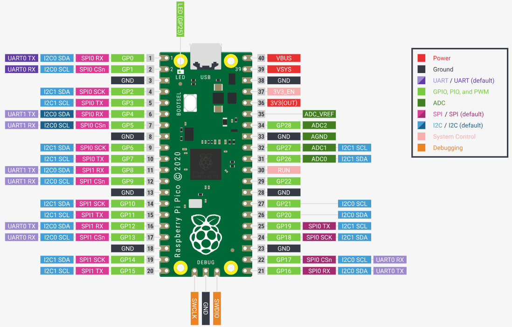
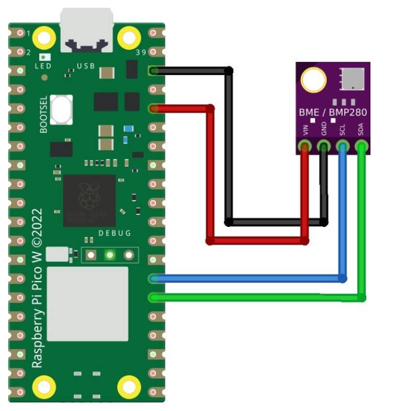

# Documentação Raspberry Pi Pico W e sensor BME/BMP 280

Edição 1.0 - Data de Publicação: 05 de dezembro de 2023

## Índice

1. [Introdução](#1-introdução)
* [Sobre o Raspberry Pi Pico W](#sobre-o-raspberry-pi-pico-w)
* [Finalidade deste Manual](#finalidade-desse-manual)

2. [Especificações Técnicas Raspberry](#2-especificações-técnicas-raspberry)
* [Processador](#processador)
* [Memória](#memória)
* [Conectividade](#conectividade)
* [GPIO (Mapeamento de Pinos)](#gpio-mapeamento-de-pinos)
* [Alimentação](#alimentação)
* [Temperatura de operação](#temperatura-de-operação)
* [Dimensões Físicas](#dimensões-físicas)

3. [Especificações Técnicas Sensor BME/BMP 280](#3-especificações-técnicas-sensor-bmebmp-280)
* [Medições](#medições)
* [Precisão](#precisão)
* [Interface de Comunicação](#interface-de-comunicação)
* [Tensão de Operação](#tensão-de-operação)

4. [Pinout (Mapeamento de Pinos)](#4-pinout-mapeamento-de-pinos)
* [GPIO](#gpio-general-purpose-inputoutput)
* [UART](#uart-universal-asynchronous-receiver-transmitter)
* [SPI](#spi-serial-peripheral-interface)
* [I2C](#i2c-inter-integrated-circuit)
* [ADC](#adc-conversor-analógico-digital)
* [Fonte de Energia](#fonte-de-energia)
* [Pinos de Controle](#pinos-de-controle)

5. [Comunicação I2C entre Raspberry Pi Pico W e Sensor BME/BMP280](#5-comunicação-i2c-entre-raspberry-pi-pico-w-e-sensor-bmebmp280)

6. [Comunicação Serial entre Raspberry Pi Pico W e PC](#6-comunicação-serial-entre-raspberry-pi-pico-w-e-pc)

7. [Vídeo Demonstrativo Implementação](#7-vídeo-demonstrativo-implementação)

## 1. Introdução

### Sobre o Raspberry Pi Pico W

O Raspberry Pi Pico W é um microcontrolador desenvolvido pela Raspberry Pi Foundation. Ele combina a facilidade de uso do Raspberry Pi com a versatilidade de um microcontrolador. O Raspberry Pi Pico W é uma excelente escolha para projetos que necessitem de alto desempenho, baixo custo e conectividade sem fio. Esta documentação fornece informações sobre o Pico W e sua conexão com o sensor de temperatura, umidade e pressão BME/BMP 280.

### Finalidade desse manual

Este manual tem como objetivo fornecer uma referência sobre o Raspberry Pi Pico W, desde suas especificações técnicas até uma forma de exemplicar suas interfaces de comunicação com o sensor BME/BMP 280 e do sensor com o PC. Ele é produzido para melhor compreensão do hardware a ser utilizado no projeto de um tapete de acessibilidade conduzido por alunos de Ciência da Computação do Instituto de Tecnologia e Liderança (Inteli).

## 2. Especificações Técnicas Raspberry
	
### Processador
* Processador: RP2040 Dual-core ARM Cortex-M0+
* Clock: 133 MHz

### Memória
* Memória Flash: 2 MB QSPI flash
* Memória SRAM: 264KB

### Conectividade
* Wi-Fi: 2.4GHz IEEE 802.11b/g/n
* Bluetooth: Bluetooth 5.2 (BLE)
* Antenas: Antenas embutidas

### GPIO (Mapeamento de Pinos)
O Raspberry Pi Pico W possui 40 pinos GPIO que podem ser usados para interagir com sensores, dispositivos e periféricos, sendo 26 deles multifuncionais, dos quais 3 ADC. Consulte o apêndice Pinout (Mapeamento de Pinos) para um mapeamento completo dos pinos e suas funções.

### Alimentação
* Tensão de Alimentação: 1.8 - 5.5V DC ou 5V USB
* Corrente Máxima: 500 mA

### Temperatura de operação
* De -20°C a 70°C;

### Dimensões Físicas
* Dimensões: 21,0 mm x 51,0 mm x 4,0 mm

## 3. Especificações Técnicas Sensor BME/BMP 280

Informações mais aprofundadas podem ser encontradas na [documentação oficial da Bosch](https://cdn.awsli.com.br/78/78150/arquivos/BMP280-datasheet.pdf)

### Medições:

* Temperatura: -40 a 85 graus Celsius
* Pressão: 300 a 1100 hPa (BMP280) / 300 a 1100 hPa (BME280)
* Umidade (apenas BME280): 0 a 100%

### Precisão:

* Temperatura: ±1 grau Celsius
* Pressão: ±1 hPa (BMP280) / ±0.12 hPa (BME280)
* Umidade (apenas BME280): ±3%
  
### Interface de Comunicação:

* Digital: I2C (BMP280 e BME280) 
* SPI: Suportado

### Tensão de Operação:

* Tensão de Alimentação: 1.71 V a 3.6 V

## 4. Pinout (Mapeamento de Pinos)

O Raspberry Pi Pico W é equipado com um conjunto de pinos GPIO que podem ser usados para interagir com diversos dispositivos e periféricos externos. Abaixo, você encontrará um diagrama que mostra o mapeamento de pinos do Raspberry Pi Pico W, incluindo as funções e as características de cada pino:

 

Imagem 1: diagrama de pinos do Raspberry Pi Pico W.

### GPIO (General-Purpose Input/Output)

Os pinos são distribuídos de 0 a 28, isto é, GPIO0, GPIO1 … GPIO28, sendo todos pinos de uso geral.

### UART (Universal Asynchronous Receiver-Transmitter)

O Raspberry Pi Pico W suporta comunicação UART (serial). Abaixo estão os pinos UART disponíveis:
* **UART0_TX (Transmit)**: Conecte dispositivos que desejam receber dados transmitidos do Pico W.
* **UART0_RX (Receive)**: Conecte dispositivos que desejam transmitir dados para o Pico W.

### SPI (Serial Peripheral Interface)

O Raspberry Pi Pico W suporta comunicação SPI para interagir com dispositivos que usam esse protocolo. Os pinos SPI disponíveis são:
* **SPI0_SCK**: Clock da interface SPI.
* **SPI0_TX**: Saída de dados mestres.
* **SPI0_RX**: Entrada de dados mestres.
* **SPI0_CSn**: Sinal de seleção de chip para dispositivos SPI.

### I2C (Inter-Integrated Circuit)

A comunicação I2C é suportada pelo Raspberry Pi Pico W. Os pinos I2C disponíveis são:
* **I2C0_SCL**: Linha de clock I2C que sincroniza o sistema.
* **I2C0_SDA**: Linha de dados I2C que envia e recebe dados.

### ADC (Conversor Analógico-Digital) 

* **ADC0**: Pino que suporta leitura analógica, permitindo que você meça uma tensão entre 0 e 3,3 V.
* **ADC1**: Pino que suporta leitura analógica, permitindo que você meça uma tensão entre 0 e 3,3 V.
* **ADC2**: Pino que suporta leitura analógica, permitindo que você meça uma tensão entre 0 e 3,3 V.

### Fonte de Energia

* **3V3(OUT)**: Tensão de saída de 3,3 V.
* **3V3_EN**: Tensão de entrada de 3,3 V.

### Pinos de Controle

* **EN**: Pino de habilitação do sistema.
* **BOOTSEL**: Pino de seleção de modo de inicialização.

## 4. Conexões entre Raspberry Pi Pico W e Sensor BME/BMP280

Imagem 2: diagrama de blocos conexão Raspberry e BME

* **VCC (3.3V)**: Conectar ao pino 3V3 do Raspberry Pi Pico W.
* **GND (GND)**: Conectar ao pino GND do Raspberry Pi Pico W.
* **SCL (Serial Clock)**: Conectar ao pino GP21 (GPIO21) do Raspberry Pi Pico W.
* **SDA (Serial Data)**: Conectar ao pino GP20 (GPIO20) do Raspberry Pi Pico W.

Como visto no diagrama acima, para a comunicação I2C ocorrer de forma satisfatória, é necessário que o sensor BME se conecte ao Raspberry Pi Pico W da forma supracitada, respeitando a porta 21 para o SCL e a porta 20 para o SDA.

## 5. Comunicação I2C entre Raspberry Pi Pico W e Sensor BME/BMP280

A comunicação I2C é um protocolo serial de dois fios que permite a comunicação entre dispositivos. No caso do Raspberry Pi Pico W e do sensor BME/BMP280, os pinos SCL e SDA são utilizados para essa comunicação entre o microcontrolador e o sensor. Ela é um protocolo de comunicação serial síncrono, o que significa que a transferência de dados é coordenada por um sinal de clock compartilhado. De forma mais aprofundada, o barramento I2C é bidirecional, o que possibilita com que múltiplos dispositivos compartilhem os mesmos fios.

De forma aplicada, a comunicação foi iniciada com o seguinte código em MicroPython:

    from machine import Pin, I2C 
    import bme280  

    i2c=I2C(0,sda=Pin(20), scl=Pin(21), freq=400000)
    bme = bme280.BME280(i2c=i2c)

Ou seja, no código acima os módulos necessários para configurar a comunicação são importados e são definidos o barramento, o pino sda (20) e scl(21), assim como a frequência de comunicação. Isso para que seja possível instanciar um objeto BME280 com a configuração do I2C supracitada. A partir desse código, é possível realizar leituras de temperatura, umidade e pressão somente chamando a variável "bme".

## 6. Comunicação Serial entre Raspberry Pi Pico W e PC

Além da comunicação I2C, é possível estabelecer uma comunicação serial entre o Raspberry Pi Pico W e um PC para visualizar os dados coletados pelo sensor. Isso ocorre por meio da transferência de dados via USB.  
No exemplo abaixo, foi incorporada uma comunicação via wifi para enviar os dados por MQTT para o MQTT Broker no PC. 

Isso pode ser visto a partir do seguinte código em MicroPython:

    wlan = network.WLAN(network.STA_IF)
    wlan.active(True)
    wlan.connect("WIFI","PASSWORD")
    time.sleep(5)
    print(wlan.isconnected())

    mqtt_server = 'mqtt-dashboard.com'
    client_id = 'judBtcUGGL'
    topic_temperature = b'Temperatura'
    topic_pression = b'Pressao'
    topic_humidity = b'Umidade'

    def mqtt_connect():
        client = MQTTClient(client_id, mqtt_server, keepalive=3600)
        client.connect()
        print('Connected to %s MQTT Broker'%(mqtt_server))
        return client

    def reconnect():
        print('Failed to connect to the MQTT Broker. Reconnecting...')
        time.sleep(10)
        #machine.reset()
        client.connect()

    try:
        client = mqtt_connect()
    except OSError as e:
        reconnect()

De forma prática, o código acima estabelece uma conexão com a internet e se conecta ao mqtt broker, enviando "topic_temperature", "topic_pression" e "topic_humidity", realizando o envio de dados lidos no microcontrolador para o PC.

## 7. Vídeo Demonstrativo Implementação

Como forma de aprofundar a implementação citada nessa documentação e demonstrar em detalhes o funcionamento da integração entre o microcontrolador e o sensor e o PC, veja o [vídeo anexo](https://drive.google.com/file/d/1SckpeSvC0C54r6In1Lo6hwNc1lOR81Jl/view?usp=drive_link) 